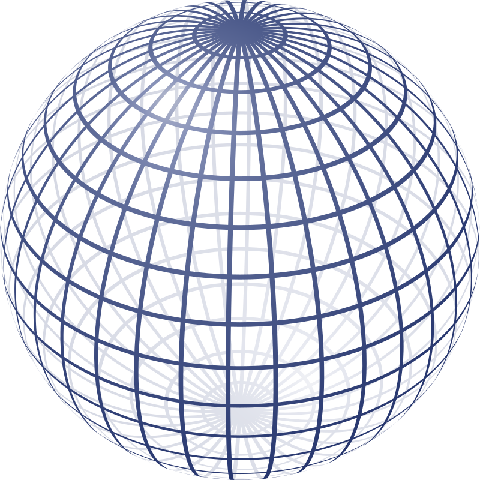
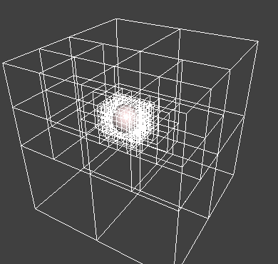
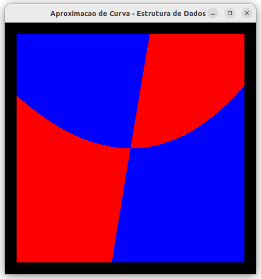

# Problema 3 - Visualização de Objetos Implícitos

## A Motivação

Objetos gráficos possuem diferentes representações matemáticas para descrever sua geometria/forma. Uma dessas representações pode ser feita através das **Superfícies Implícitas** [1]. Exemplos bem simples dessa representação podem ser vistos na Figura 1, onde podemos ver a forma de uma esfera e de um toro e suas respectivas equações implícitas.  

|  |  | 
| :---: | :---: |
|  |  |

*Figura 1 - Exemplos de formas implicitas: esfera e toro.* 

Existem várias vantagens nesse tipo de representação. Uma delas é que podem ser combinadas a partir de operações simples de conjuntos, como União (&cup;), Inteseção (&cap;) e Diferença (-). Isso se dá pelo fato de que esse tipo de equação matemática permite a classificação de pontos do espaço em 3 categorias: i) sobre a superfície (satisfazem a equação) e ii) pontos fora da superfícies (aqueles onde a equação não é satisfeita). Se tomarmos com exemplo a equação da esfera da Figura 1, pontos cuja distancia ao centro seja igual ao raio (2 nesse exemplo - R² = 4) irão ter valor zero na equação. Pontos no interior da esfera irão gerar distancia menor que o raio, e portanto um valor < 0 na equação. De modo análogo, pontos no exterior da esfera vão gerar valores > 0, pois sua distancia até o centro será maior que o raio. 

Portanto, cada equação implícita define um conjunto de pontos que satisfaz uma dada equação. A esses conjuntos de pontos podem ser aplicadas operações como União (&cup;) que produz um novo conjunto que satisfaz a pelo menos uma das equações, ou Intereseção (&cap;), onde os pontos devem satisfazer a todas as equações. Na Figura 2 podemos ver o resultado dessas operações para 2 formas implícitas simples, uma esfera e um cubo.  

|  |  |  | 
| :---: | :---: | :---: |
| União (&cup;) | Inteseção (&cap;) | Diferença (-) |

*Figura 2 - Formas complexas baseadas em objetos implícitos simples a partir de composição.* 

Na Figura 3 podemos ver 2 exemplos de formas com alto grau de complexidade, construídas a partir de formas implicitas simples combinadas. Esse tipo de modelo é chamado de *Constructive Solid Geometry* ou *CSG* [2].  

*Figura 3 - Formas complexas baseadas em objetos implícitos simples a partir de composição.* 

Ao mesmo tempo que essa característica é um ponto forte, em termos de flexibilidade e poder de expressão, é também seu ponto fraco em termos de visualização. Como não há uma forma direta de determina precisamente os pontos da superficie torna-se difícil desenha-la. 

Nesse contexto, uma das formas de visualização desses modelos passa por uma etapa de **busca** por pontos que satisfação a equação implícita em um certo domínio do espaço. O processo de busca, em geral, utiliza um algoritmo que segue um paradigma **dividir-para-conquistar**. Esse algoritmo promove a subdivisão do domínio e, a partir da analise de cada sub-domínio gerado (resultado do processo de subdivisão), se podem haver pontos de interesse, ou seja, pontos que satisfaçam *f(x,y,z)=0*.

Na Figura 4 vemos, para um modelo implícito de uma esfera, como essa subdivisão é capaz de localizar a região do espaço onde a esfera se encontra. Podemos notar que, tão logo um sub-domínio que não contenha a superfície de interesse é detectado, o processo de subdivisão para. Dessa forma, apenas as regiões que contem a superficie de interesse são refinadas até que uma certa precisão (nível de refinamento) seja alcançado. Podemos notar pela animação da imagem que dependendo da localização do objeto a subdivisão é diferente. 

*Figura 4 - Processo de **dividir-para-conquistar** onde o objetivo é localizar a superfície implicta f(x,y,z) = 0.* 

Algoritmos baseados no paradigma **dividir-para-conquistar** podem ser mapeados em uma estruturas de dados hierárquica[3]. Um caso já estudado no curso é o da relação entre o algoritmo de busca binária e a estrutura de uma árvore binária de busca[^1] [3]. 

Para o caso da visualização de objetos implicitos, a busca pela superficie que satisfaz a equação implicita também pode ser mapeada em uma estrutura de dados hierárquica. 

Para facilitar a construção dessa relação tomemos um exemplo em um domínio 2D. Nesse caso, nossos objetos implicitos passam a ser curvas. A Figura 5 mostra apenas o mapeamento do processo de subdivisão do domínio 2D mapeada em uma estrutura hierarquica, no caso uma árvore. Diferentemente da busca binária, cujo dominio é unidimensional e gera uma árvore de ordem 2, a subdivisão de um dominio 2D irá gerar uma árvore de ordem 4 (o espaço deve ser dividido em 2 dimensões, horizontal e vertical), como mostra a Figura 5. 
  

*Figura 5 - Construção de uma subdivisão espacial de um domínio 2D e seu mapeamento em uma árvore de ordem 4.* 
  
No exemplo da Figura 5, o critério utilizado para o refinamentos de cada sub-domínio foi a presença de apenas um ponto em seu interior. Notamos que nesse caso sub-domínios não são refinados quando se encontram sem pontos, que sub-dominios podem parar de ser refinados tão logo possuam apenas um ponto em seu interior. Lembramos que os sub-domínios também podem parar de ser refinidos mesmo contendo mais de um ponto, caso alcancem um nível máximo de refiniamento.  

## O Problema

Nosso objetivo é construir uma aplicação em *Python* [4] que, dada uma função implícita de curva no espaço 2D, construa uma estrutura de dados que permita visualizar essa curva. A aplicação deve fornecer 3 formas de visualização:

1. A curva aproximada pela estrutura de subdivisão espacial, dada uma resolução;
2. A subdivisão espacial determinando as divisão do espaço em regiões internas, externas e de fronteira da curva;
3. A visualização da estrutura de dados desenhada em todos os seus níveis.

A Figura 6 mostra esses 3 tipos de visualização. 

| 1 | 2 | 3 |
| :---: | :---: | :---: |
|  |  |  | 

*Figura 6 - As 3 formas de visualização.* 

Sua aplicação deve estabelecer (de forma parametrizada, definida na chamada da aplicação) qual a precisão será utilizada na estrutura de subdivisão, definindo um nível máximo de refinamento. 

No processo de visualização o nível de precisão poderá ser reduzido pelo usuários, de forma iterativa. Na Figura 7 podemos observar o resultado visual desse tipo de controle. 

| 1 | 2 | 3 |
| :---: | :---: | :---: |
|  |  |  | 

*Figura 7 - Curva visualizada em 3 níveis diferentes de resolução.* 

Para facilitar seus testes a Tabela 1 apresenta algumas curvas e suas equações implícitas. A escolha da função deve ser feita dentro da aplicação, na forma de algum codigo. Tome cuidado com a definição dos domínios de busca para cada função, pois eles podem ser diferentes. **Sua aplicaçào deve implementar pelo menos 3 funções diferentes, inclusive distintas dessas**.

| 0 | 1 | 2 | 3 | 4 | 5 | 6 | 7 |
| :---: | :---: | :---: | :---: | :---: | :---: | :---: | :---: |
|  |  |  |  |  |  |  |  |
| x² / a² + y² / b² - 4 | (x² + y² - 4)³ - x² * y³ |  x² - 4ay - 0.5 | x² + y² + xy - (xy)² * 0.5 - 0.25 | x⁷ - y⁵ + x² * y³ - (xy)² | x³ + y² - 6xy | abs(x) + abs(y) - 2 | x³ + y - 4 | x⁴ + y⁴ - xy - 8 |

*Figura 8 - Exemplos de curva e suas formas implicitas. As formas de visualização foram feitas de forma a identificar melhor o comportamento de cada função.* 
			
## O Produto

A aplicação deve utilizar, para o suporte a parte gráfica, a biblioteca [pyglet](https://pyglet.org/)[6] para o controle da interface com o usuário (basicamente captura de teclas para mudança de estado) e desenho das primitivas[^2]. 
	
O problema deve ser submetido via *GitHub Classroom* até o dia 05/12/2022, na forma de um repositório contendo:

* O código fonte da aplicação; 
* Um relatório técnico resumido (README), descrevendo como voce resolveu o problema, as escolhas dos algoritmos e estruturas de dados utilizados no desenvolvimento da aplicação, a analise da complexidade dos algoritmos de construção e visualização, apresentando justificativas para cada escolha no projeto.  

No dia 06/12/2022 cada dupla deverá apresentar sua solução, em apresentação presencial, de 5 minutos, mostrando sua solução[^3].  

## A Avaliação:

Sua aplicação será avaliado pelos seguintes critérios:

| Critério | Pontuação |
| :--- | :---: |
| 1. Relatório técnico (README em Markdown[7][8]) | 0,5 |
| 2. Modularização do código [6] | 1,0 | 
| 3. Definição dos TADs  | 1,0 |
| 4. Construção da subdivisão espacial   | 2,0 |
| 5. Visualização da estrutura por nível  |  |
| 	Modo 1   |  1,0 |
| 	Modo 2   |  1,5 |
| 	Modo 3   |  1,5 |
| 6. Apresentação | 1,5 |

## Observações Gerais:

**Plágio não é uma prática aceitável nem na academia nem no mercado de trabalho. 
Uma vez detectada TODOS os envolvidos serão penalizados.**

Não presuma nada! Pergunte ao professor, monitor ou estagiário docente. 

Discussões conceituais e de interpretação do problema podem ser feitas no canal do problema no *Discord*. 

Dúvidas específicas relacionadas a sua solução ou ao seu código  devem ser feitas em consultas privadas no *Discord* ou com *issues* no *github Classroom* 

# Referências Bibliográficas:

[1] Wikipedia, **Implicit Surface**. https://en.wikipedia.org/wiki/Implicit_surface

[2] Wikipedia, **Constructive Solida Geoemtry**. https://en.wikipedia.org/wiki/Constructive_solid_geometry

[3] Cormen,T.H., Leiserson,C.E., Rivest,R.L., Stein,C. **Algoritmos – Teoria e Prática**. Editora Campus. 3a Edição, 2012..

[4] Canning, J., Broder, A., Lafore, R. **Data Structures & Algorithms in Python**. Addison-Wesley. 2022.

[5] pyglet. **pyglet Documentation**. https://pyglet.readthedocs.io/en/latest/

[6] Erica Vartanian, **"6 coding best practices for beginner programmers"**. Disponível em:  https://www.educative.io/blog/coding-best-practices

[7] Matt Cone, **Markdown Cheat Sheet - A quick reference to the Markdown syntax**. Disponível em: https://www.markdownguide.org/cheat-sheet/

[8] GitHub Docs. Introdução à escrita e formatação no GitHub. Disponível em: https://docs.github.com/pt/github/writing-on-github/getting-started-with-writing-and-formatting-on-github

[^1]: Deixando claro que uma ABB qualquer não necessáriamente representa um processo de busca binária no conjunto de chaves que ela contem. 

[^2]: Para auxiliar esse processo o professor vai disponibilizar um "demo" que poderá ser utilizado como base para a etapa de visualização. 

[^3]: O formato da apresentação será definido pelo professor. 

